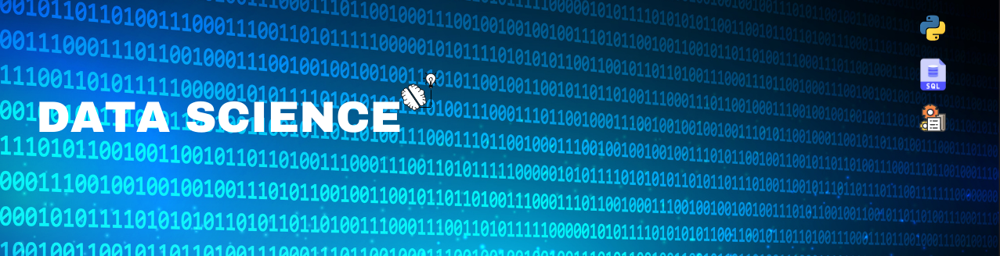

   

  

image credit: [LinkedIn](linkedin.com/in/kattson-bastos-07b07a194/)

# Kattson Bastos
*Student* at the Universidade Estadual do Sudoeste da Bahia and *student researcher* at the Grupo de Pesquisa em Economia, Meio Ambiente e Inovação

As a beginner in Data Science, I aim to combine soft and hard skills, such as ability to work in team environments, negotiation techniques, Python programming, Data Base management and Machine Learning. Starting the study in Data Science and Financial Markets, I want to develop a critical thinking and problem-solving skills.

I'm current taking a Bachelor's degree in Economics at the Universidade Estadual do Sudoeste da Bahia (State University of Southwest Bahia) and I'm a student researcher at the Grupo de Pesquisa em Economia Meio ambiente e Inovação (Research Group in Economics, Environment and Innovation) at the same university.

**Skills I'm developing:** Python, SQL, Data Science Projects Management, Machine Learning, Mathematical Optmization, Financial Portfolio Management, Negotiation Techniques.

**Links:**
* [LinkedIn](linkedin.com/in/kattson-bastos-07b07a194/)

## Projects:
Take a look at the projects I'm working on:

* **Eleições Municipais de 2020: Análise do Perfil dos Candidatso Eleitorais de Vitória da Conquista, Ba -** https://github.com/KattsonBastos/eleicoes_vca_2020
---

